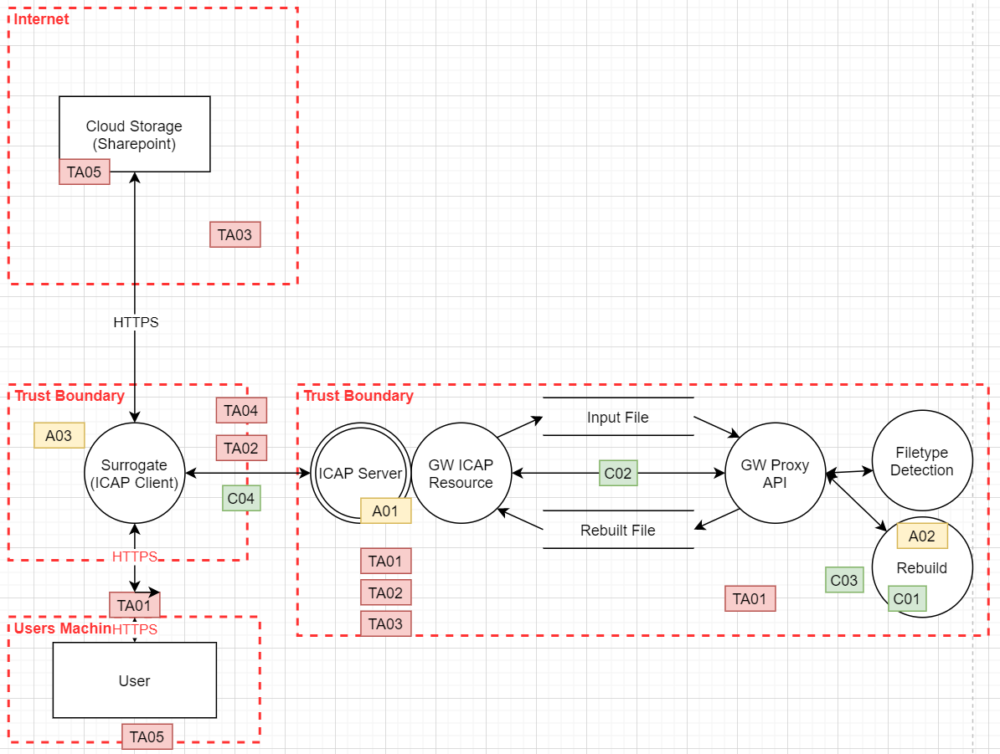

# On-Premise Threat Model

This model examines the controls and defenses needed to enable the secure running of the Glasswall ICAP service deployed within a customer network.

## Data-flow Diagram

## Facts

These are immutable assumptions under which the threat modelling is undertaken.

ID  | Description 
:---|:------------
F01 | Assume the internal customer network is secure.
F02 | Assume that the ICAP Server does not handle a malicious ICAP Client.
F03 | Assume that at no point in the processing of a file is it 'opened' thus triggering any malicious content.

##  Security Controls

ID  | Description 
:---|:------------
C01 | GW Engine Run in Docker Container to limit Blast Radius
C02 | Network security Controls
C03 | Kubernetes Cluster
C04 | Functional Testing with Abuse Cases

## Assets

ID  | Description 
:---|:------------
A01 | ICAP Server
A02 | Rebuild
A03 | ICAP Client

## Threat Actor

ID   | Description 
:----|:------------
TA01 | Attacker inside internal network
TA02 | Accidental User/Malicious Attacker
TA03 | Malicious Insider or Customer with access to internal network
TA04 | Internal Ineffective/Accidental
TA05 | Malicious File Sender

# Threat Register
Component (C) and/or Trust Boundary (TB)| Threat | Threat Actor | Threat Actor Skill Required | Vulnerability | Risk | Risk Possibility | Risk Impact | Risk Level | Security Control 
:----------------------------------|:-------|:-------------|:----------------------------|:--------------|:-----|:-----------------|:------------|:-----------|:----------------
ICAP Client - ICAP Server (TB)| Session hijacking/ MITM | Attacker inside internal network | Advanced | No encryption | External Attacker executing a MITM | Very Unlikely | Significant | Medium | Accept 
Rebuild API (C)| Remote code execution from malicious file | User Accidental/Malicious Attacker | Advanced | 0-day vulnerability | File enabling remote code execution | Unlikely | Severe | Medium Hi | SC01
ICAP Client - ICAP Server (TB)| Tampering |Malicious Insider or customer with access to internal network | Intermediate | No signing ability/validation | Input/Output Tampered | Possible | Minor | Low Med | Accept
ICAP Client - ICAP Server (TB)| Data leak |Internal Ineffective/Accidental | Begginer | No encryption | Reputational damage, unplanned costs due to data leak | Very Unlikely | Significant | Medium | Present To Customer [1](#f1)
Internal Network (C)|  Information disclosure after a soft delete |  Malicious File | Begginer | Transferring malicious files | Information disclosure after a soft delete | Very Unlikely | Severe | Low Medium | Accept
User - ICAP server (HTTPS) (TB)| Session hijacking/MITM/spoofing | External Attacker/Rogue user | Advanced | Vulnerable if old versions used | Unplanned costs, Reputational damage | Unlikely | Minor | Low Med | Out of Scope [2](#f2)
ICAP Server (C)| Malicious file parsing through Rebuild | Malicious File Sender | Advanced | Buffer Overflow Vulnerability | Unplanned costs due to GW Engine repair after buffer overflow attack | Unlikely | Severe | Medium Hi | SC02, SC03, SC04
ICAP Server (C)| Malicious file parsing through Rebuild | Malicious File Sender | Advanced | DoD Vulnerability | Unplanned costs due to GW Engine Repair, Reputational Damage, Customer Loss | Unlikely | Severe | Medium Hi | SC02, SC03, SC04

<b id="f1">1</b> Present to customer and the customer decides on risk. [↩](#a1)  
<b id="f2">2</b> Out of scope - assumption that F5 network is safe (F01) [↩](#a2)
